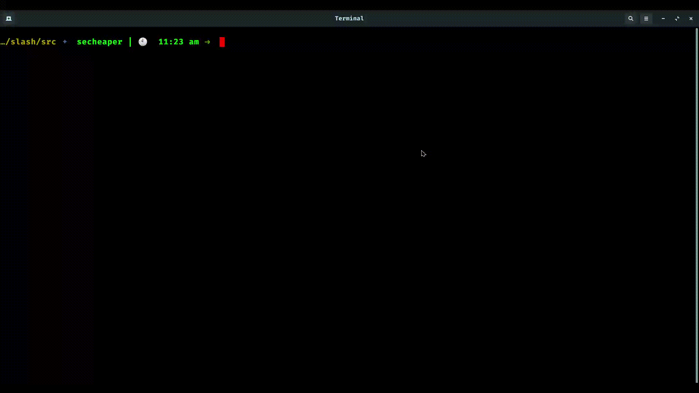

<p align="center"></p>


 
[](https://zenodo.org/badge/latestdoi/407550383)


[](https://codecov.io/gh/secheaper/slash)

Slash is a command line tool that scrapes the most popular e-commerce websites to get the best deals on the searched items across these websites. 
- **Fast**: With slash, you can save over 50% of your time by comparing deals across websites within seconds
- **Easy**: Slash uses very easy commands to filter, sort and search your items
- **Powerful**: Quickly alter the commands to get desired results

<p align="center">
  <a href="#rocket-installation">Installation</a>
  ::
  <a href="#golf-flags-and-command-line-arguments">Flags & Args</a>
  ::
  <a href="#card_index_dividers-some-examples">Examples</a>
  ::
  <a href="#page_facing_up-why">Why</a>
  ::
  <a href="#sparkles-contributors">Contributors</a>
  
</p>

---

<p align="center"></p>

---

:rocket: Installation
---
1. Clone the Github repository to a desired location on your computer. You will need [git](https://git-scm.com/) to be preinstalled on your machine. Once the repository is cloned, you will then ```cd``` into the local repository.
```
git clone https://github.com/secheaper/slash.git
cd slash
```
2. This project uses Python 3, so make sure that [Python](https://www.python.org/downloads/) and [Pip](https://pip.pypa.io/en/stable/installation/) are preinstalled. All requirements of the project are listed in the ```requirements.txt``` file. Use pip to install all of those.
```
pip install -r requirements.txt
```
4. Once all the requirements are installed, you will have to ```cd``` into the ```src``` folder. Once in the ```src``` folder, use the python command to run the ```slash.py``` file.
```
cd src
python3 slash.py --search "philips hue"
```
:golf: Flags and Command Line Arguments
---
Currently the tool supports the following flags and command line arguments. These flags and arguments can be used to quickly filter and guide the search to get you the best results very quickly.

| Arguments | Type | Default | Description                                                          |
|-----------|------|---------|----------------------------------------------------------------------|
| --search  | str  | None    | The product name to be used as the search query                      |
| --num     | int  | 3       | Maximum number of products to search                                 |
| --sort    | str  | re      | Sort results by relevance (re) or by price (pr)                      |
| --des     | bool | -       | Set boolean flag if results should be sorted in non-increasing order |

:card_index_dividers: Some Examples
---

#### 1. Searching
```--search```  accepts one argument string which it uses to search and scrape the requested products on 
the e-commerce websites. So, to use this, run the python script followed by the --search argument and the 
search string. The search string should be in double quotes if it have two or more words. Example:
```
python3 slash.py --search socks
```
```
| timestamp           | title                                       | price   | website   |
|---------------------|---------------------------------------------|---------|-----------|
| 29/09/2021 14:00:55 | Men's 6 Pack Ankle Running Socks Low Cut... | $15.95  | amazon    |
| 29/09/2021 14:00:55 | 6 Pack Women's Ankle Running Socks, Low ... | $15.95  | amazon    |
| 29/09/2021 14:00:55 | UltraGlide Friction-Free No-Show Running... | $17.00  | amazon    |
| 29/09/2021 14:00:57 | Gildan Adult Men's Performance Cotton mo... | $10.97  | walmart   |
| 29/09/2021 14:00:57 | Reebok Women's Lightweight Low Cut Socks... | $8.97   | walmart   |
| 29/09/2021 14:00:57 | Athletic Works Men's Ankle Socks 12 Pack    | $9.97   | walmart   |
```
#### 2. Sorting
```--sort``` accepts one or more arguments that determine how the tool sorts and filters the requested products
after scraping. The first value is used to initially sort and filter the results of the scraping. The arguments
following the first one are not required but will be used to further sort the filtered results. Example:
```
python3 slash.py --search socks --sort pr
```
```
| timestamp           | title                                       | price      | website   |
|---------------------|---------------------------------------------|------------|-----------|
| 29/09/2021 14:06:38 | Fruit of the Loom Boys Dual Defense Cush... | $7.97      | walmart   |
| 29/09/2021 14:06:37 | womens Active 6 Pair Pack Socks             | $7.99      | amazon    |
| 29/09/2021 14:06:37 | womens 6-pair Lightweight Breathable Ven... | $8.97      | amazon    |
| 29/09/2021 14:06:38 | Reebok Women's Lightweight Low Cut Socks... | $8.97      | walmart   |
| 29/09/2021 14:06:38 | Hanes Women's Cool Comfort Sport Ankle S... | From $8.97 | walmart   |
| 29/09/2021 14:06:37 | Women's 6 Pack Runner Socks                 | $9.66      | amazon    |
```
#### 3. Sort Order
The ```--des``` flag can be set to sort the requested products in a non-increasing order. This flag will be 
actually used when coupled with ```--sort```. Example:
```
python3 slash.py --search socks --sort pr --des
```
```
| timestamp           | title                                       | price   | website   |
|---------------------|---------------------------------------------|---------|-----------|
| 29/09/2021 14:10:21 | Performance Cushion Crew Socks with Band... |         | amazon    |
| 29/09/2021 14:10:21 | 6-pk. Performance Cotton Crew Socks Size... | $34.50  | amazon    |
| 29/09/2021 14:10:21 | Womens Bulk 36 Pack Ultimate Athletic Sp... | $29.95  | amazon    |
| 29/09/2021 14:10:22 | Woman's 6 Pack Thick Thermal Crew Cold W... | $19.99  | walmart   |
| 29/09/2021 14:10:22 | Jobsite's Men's Fast Dry Shrink Resistan... | $19.44  | walmart   |
| 29/09/2021 14:10:22 | Gildan Adult Men's Performance Cotton mo... | $10.97  | walmart   |
```

#### 4. Result length
The maximum number of results that are scraped from each website can be set using the ```--num``` argument. It accepts
an integer value ```n``` and then returns ```n``` results from each website. Note that tool returns a maximum of 
the value of ```n``` and the number of results on the webiste. By default this value is set to 3. Example:
```
python3 slash.py --search socks --num 5
```
```
| timestamp           | title                                       | price   | website   |
|---------------------|---------------------------------------------|---------|-----------|
| 29/09/2021 14:13:45 | Men's 6 Pack Ankle Running Socks Low Cut... | $15.95  | amazon    |
| 29/09/2021 14:13:45 | 6 Pack Women's Ankle Running Socks, Low ... | $15.95  | amazon    |
| 29/09/2021 14:13:45 | UltraGlide Friction-Free No-Show Running... | $17.00  | amazon    |
| 29/09/2021 14:13:45 | u&i Men's Performance Cushion Cotton Ath... | $19.99  | amazon    |
| 29/09/2021 14:13:45 | Mens Cushioned Work Socks 10 Pairs          | $12.10  | amazon    |
| 29/09/2021 14:13:46 | Gildan Adult Men's Performance Cotton mo... | $10.97  | walmart   |
| 29/09/2021 14:13:46 | Reebok Women's Lightweight Low Cut Socks... | $8.97   | walmart   |
| 29/09/2021 14:13:46 | Athletic Works Men's Ankle Socks 12 Pack    | $9.97   | walmart   |
| 29/09/2021 14:13:46 | Athletic Works Men's Crew Socks 12 Pack     | $9.97   | walmart   |
| 29/09/2021 14:13:46 | Aerosoles Women's Low Cut Socks, 10-Pack    | $10.00  | walmart   |
```

Use Case
---
* Students: Students coming to university are generally on a budget and time constraint and generally spend hours wasting time to search for products on Websites. Slash is the perfect tool for these students that slashes all the unnecessary details on a website and helps them get prices for a product across multiple websites.
* Data Analysts: Finding data for any project is one of the most tedious job for a data analyst, and the datasets found might not be the most recent one. Using slash, they can create their own dataset in real time and format it as per their needs so that they can focus on what is actually inportant.

:page_facing_up: Why
---
- In a market where we are spoilt for choices, we often look for the best deals.  
- The ubiquity of internet access has leveled the retail playing field, making it easy for individuals and businesses to sell products without geographic limitation. In 2020, U.S. e-commerce sales, receiving a boost due to the COVID-19 pandemic, grew 44% and represented more than 21% of total retail sales, according to e-commerce information source Internet Retailer.
- The growth of e-commerce has not only changed the way customers shop, but also their expectations of how brands approach customer service, personalize communications, and provide customers choices.
- E-commerce market has prompted cut throat competition amongst dealers, which is discernable through the price patterns for products of major market players. Price cuts are somewhat of a norm now and getting the best deal for your money can sometimes be a hassle (even while online shopping).
- This is what Slash aims to reduce by giving you an easy to use, all in one place solution for finding the best deals for your products that major market dealers have to offer!


:sparkles: Contributors
---

<table>
  <tr>
    <td align="center"><a href="http://www.shubhammankar.com/"><br /><sub><b>Shubham Mankar</b></sub></a></td>
    <td align="center"><a href="https://github.com/pratikdevnani"><br /><sub><b>Pratik Devnani</b></sub></a><br /></td>
    <td align="center"><a href="https://github.com/moksh98"><br /><sub><b>Moksh Jain</b></sub></a><br /></td>
    <td align="center"><a href="https://rahilsarvaiya.tech/"><br /><sub><b>Rahil Sarvaiya</b></sub></a><br /></td>
    <td align="center"><a href="https://github.com/annie0467"><br /><sub><b>Anushi Keswani</b></sub></a><br /></td>
  </tr>
</table>
